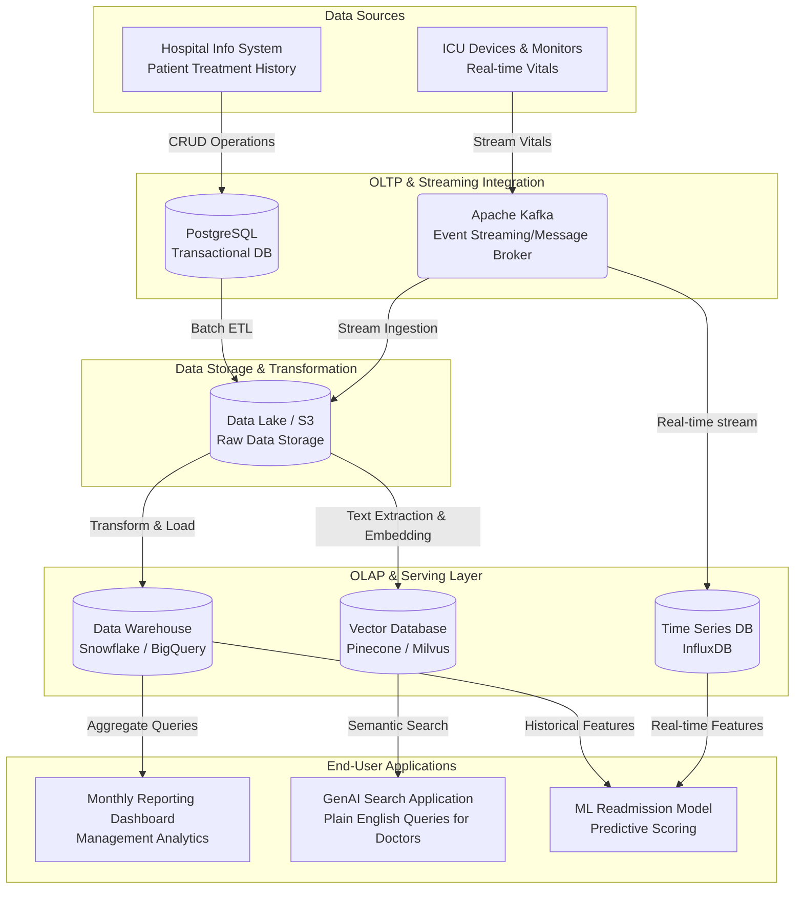

# Architecture Diagram
*(Please render this markdown file in GitHub or use a Mermaid Live Editor to save as `architecture_diagram.png` for submission)*

```mermaid
graph TD

%% Data Sources Layer
    subgraph Data Sources
        A[Hospital Info System<br/>Patient Treatment History]
        B[ICU Devices & Monitors<br/>Real-time Vitals]
    end

%% OLTP & Ingestion Layer
    subgraph OLTP & Streaming Integration
        C[(PostgreSQL<br/>Transactional DB)]
        D(Apache Kafka<br/>Event Streaming/Message Broker)
        A -- CRUD Operations --> C
        B -- Stream Vitals --> D
    end

%% Storage & Data Lake
    subgraph Data Storage & Transformation
        E[(Data Lake / S3<br/>Raw Data Storage)]
        C -- Batch ETL --> E
        D -- Stream Ingestion --> E
    end

%% Specialized Analytics (OLAP) & AI Layer
    subgraph OLAP & Serving Layer
        F[(Data Warehouse<br/>Snowflake / BigQuery)]
        G[(Vector Database<br/>Pinecone / Milvus)]
        H[(Time Series DB<br/>InfluxDB)]
        
        E -- Transform & Load --> F
        E -- Text Extraction & Embedding --> G
        D -- Real-time stream --> H
    end

%% Consumption Layer
    subgraph End-User Applications
        I[Monthly Reporting Dashboard<br/>Management Analytics]
        J[GenAI Search Application<br/>Plain English Queries for Doctors]
        K[ML Readmission Model<br/>Predictive Scoring]
        
        F -- Aggregate Queries --> I
        G -- Semantic Search --> J
        F -- Historical Features --> K
        H -- Real-time Features --> K
    end
```
